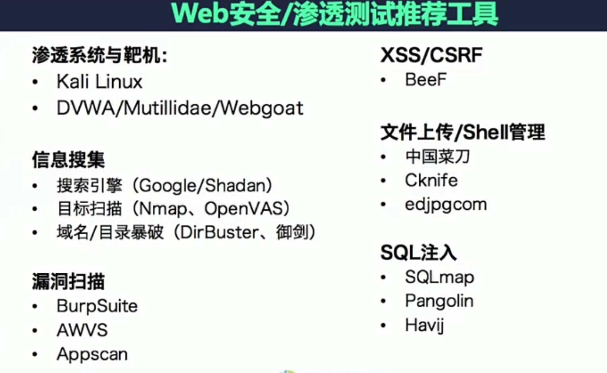

# 网络安全 拼客学院-陈鑫杰 2017.9.22

[TOC]


# §0 评价

直播课，有互动，有说有笑，kksk。

# §1 网络安全简介

## §1.1 网络安全入门导论

```mermaid
graph LR
	A(安全企业) <-- 对抗 --> B(网络犯罪)
	B --攻击 窃取--> C(政府 企业 民众)
	A --保护--> C
```

<a style="color:red">注意介绍的企业招聘岗位、要求！</a>

## §1.2 基本技能

- 掌握各类网络协议的原理与实践：

  - TCP/IP
  - VLAN/Trunk/MSTP/VRRP/802.1X
  - OSPF/BGP/MPLS
  - IPsec/SSL

- 掌握主流网络和安全工具的使用

  - GNS3/Cisco PT/eNSP/SecureCRT/Wireshark/Solorwinds

- 掌握主流网络与安全设备的命令调试与故障排查

  - 思科/华为/华三/锐捷/Juniper/飞塔/绿盟/深信服/天融信
  - 路由器/交换机/防火墙/IDS/IPS/AC/AD/VPN

- 掌握网络安全架构与设计

  - 企业网/政务网/教育网/数据中心网设计与部署

## §1.3 推荐书单

  《CCNA学习指南》《TCP/IP详解卷一》《局域网交换机安全》《Cisco防火墙》《网络安全原理与实践》《网络安全技术与解决方案》《华为防火墙技术漫谈》《Cisco网络黑客大曝光》《Wireshark网络分析实战》《Wireshark数据包分析实战》《DDos攻击与防范深度剖析》《Cisco VPN完全配置指南》《Cisco安全入侵检测系统》《计算机网络实践教程-基于GNS3网络模拟器》《互联网企业安全高级指南》

## §1.4 安全工具

- GNS3
- Cisco PT
- eNSP
- SecureCRT
- Wireshark
- Nmap
- Vmware
-  Visio
- Cain
- Ettercap
- Hping3


## §1.5 学习方法

- 先网络后安全
- 勤做实验勤抓包
- 单点突破横向拓展
- 从工程实施到方案设计




# §2 计算机网络

## §2.1 Ethernet协议

用于实现链路层数据传输和地址封装。

```wireshark
Ethernet II, Src: RuijieNe_91:13:ba (58:69:6c:91:13:ba), Dst: IntelCor_2b:78:f7 (dc:1b:a1:2b:78:f7)
    Destination: IntelCor_2b:78:f7 (dc:1b:a1:2b:78:f7)
        Address: IntelCor_2b:78:f7 (dc:1b:a1:2b:78:f7)
        .... ..0. .... .... .... .... = LG bit: Globally unique address (factory default)
        .... ...0 .... .... .... .... = IG bit: Individual address (unicast)
    Source: RuijieNe_91:13:ba (58:69:6c:91:13:ba)
        Address: RuijieNe_91:13:ba (58:69:6c:91:13:ba)
        .... ..0. .... .... .... .... = LG bit: Globally unique address (factory default)
        .... ...0 .... .... .... .... = IG bit: Individual address (unicast)
    Type: IPv4 (0x0800)
```

## §2.2 IP协议

```wireshark
Internet Protocol Version 4, Src: 183.134.40.170, Dst: 10.5.177.40
    0100 .... = Version: 4
    .... 0101 = Header Length: 20 bytes (5)
    Differentiated Services Field: 0x00 (DSCP: CS0, ECN: Not-ECT)
        0000 00.. = Differentiated Services Codepoint: Default (0)
        .... ..00 = Explicit Congestion Notification: Not ECN-Capable Transport (0)
    Total Length: 1500
    Identification: 0x5b8d (23437)
    Flags: 0x4000, Don't fragment
        0... .... .... .... = Reserved bit: Not set
        .1.. .... .... .... = Don't fragment: Set
        ..0. .... .... .... = More fragments: Not set
    Fragment offset: 0
    Time to live: 43
    Protocol: TCP (6)
    Header checksum: 0x5331 [validation disabled]
    [Header checksum status: Unverified]
    Source: 183.134.40.170
    Destination: 10.5.177.40
```

- `Version`：版本号，标识IP协议的版本

  > 0100：化为十进制为4，代表IPv4

- `Header Length`：头部长度，代表整个IP协议数据包中，除了数据以外所占的行数，每一行有4个byte

  > 0101：默认为5，表示共有$5行×4\text{bit/行}=20$个byte，相当于$20×8=160$个bit
  >
  > 最大为60byte，此时超出20个byte的部分称为data

- `Differentiated Services Filed`：服务区分符，为不同的数据包定义不同的服务质量，常用于QoS

- `Total Length`：总长度，表示上一层被封装的总数据长度，最大为65536字节

- `Identification`：标识符，用来实现IP分片的充足，标识分片属于哪个进程，进程通过id区分

- <span name="1">`Flags`</span>：标志符，用于确认是否还有IP分片，或者能否执行分片

- `Fragment offset`：分片偏移量，标识IP分片的序号，从而实现IP分片的重组

- `Time to live`：生存时间，表示数据包还能生存多久，没经过一个三层设备（如路由器）则减1，值为0时被抛弃

- `Protocol`：协议号，表示IP协议上层应用

  > 00000001：1，代表ICMP协议号
  >
  > 00000110：6，代表TCP协议号
  >
  > 00010001：17，代表UDP协议号

- `Header checksum`：头部校验，若数据包不完整或被修改则被直接丢弃

  > 将整个IP协议中除了`Header checksum`部分以外的所有双十六进制数字相加，将其拆为千分位以下和千分位以上两个数字，相加得到千位数字，取其反码作为`Header checksum`
  >
  > 例如：01000101 00000000 00000000 00101000 01010001 11010010 01000000 00000000 10000000 00000110 **11111010 01100111** 00001010 00000101 10110001 00101000 01101111 11001110 11010010 01001011
  >
  > 除去**00000000 00000000**以外的所有八位二进制数字相加，得到00000101 10011000~(2)~，取反码得到11111010 01100111~(2)~，即0xF167

- `Source`：源IP地址

  > 共32bit，对应4个0~255的点分十进制数字

- `Destination`：目的IP地址

  > 共32bit，对应4个0~255的点分十进制数字

$$
\begin{cases}
\text{ID}+\text{Flags}+\text{Fragment offset}:实现\text{IP}数据分片和重组\\
\text{TTL}:实现通信防环\\
\text{DSCP}:实现流量控制\\
\text{Protocal}:标记上层应用
\end{cases}
$$

## §2.3 TCP协议

- 面向连接（三次握手，四次挥手）
- 可靠传输（经典重传、超时重传、快速重传/选择性重传）
- 流量控制（滑动窗口、拥塞管理）
- 多路复用（套接字）

`SYN`(Synchronous)和`ACK`(Acknowledgement)由TCP协议中的<a href="#1">Flags</a>字段中的一部分来确定.

```
//建立连接的三次握手
PC<100>→Server<80> 数据包1 TCP:SYN<80>，请求访问
Server<80>→PC<100> 数据包2 TCP:ACK/SYN<100>，允许访问
PC<100>→Server<80> 数据包3 TCP:ACK，确认允许访问

//使用连接
PC<100>→Server<80> 数据包 HTTP/GET/POST/....

//断开连接的四次挥手
PC<100>→Server<80> 数据包1 TCP:FIN
Server<80>→PC<100> 数据包2 TCP:ACK
Server<80>→PC<100> 数据包2 TCP:FIN
PC<100>→Server<80> 数据包1 TCP:ACK
```

## §2.4 ARP协议

将ip比作收件人姓名，将MAC比作收件人地址，第一个数据包中含有PC1的ip，PC1的MAC，PC2的MAC地址，没有PC2的MAC地址，所以无法发出。

```
//ARP请求包
PC1→PC2 ARP Request

//ARP回应包
PC2→PC1 ARP Reply
```

发第二个包之前，系统已经受到了ARP回应包，所以可以发出。

# §3网络攻击

## §3.1 ARP攻击

```mermaid
graph TB
	A(PC1)-->B((SW1))
	C(PC_hacker)-->B
	D(PC2)-->B
```

当PC1发出`ARP Request`时，黑客机和PC2同时发出`ARP Response`，PC1最终选择最先收到的数据包。为确保欺骗成功，PC_hacker使用专业的安全工具高强度发送数据包，最终将PC1中的PC2物理地址顶替掉。

### §3.1.1 P2P终结者/Ettercap/Cain & Abel

telnet route-server.ip.att.net

Flow TCP Stream -- Wireshark

### §3.1.2 ARP防御

有两点可以防御：

- 保证PC不收到ARP欺骗包

  安装安全软件。

  - 自带ARP防御功能：腾讯电脑管家、360安全卫士......

  - 专业的ARP防火墙：彩影ARP、金山贝壳、360APR防火墙......

  - ARP双向绑定：在Windows Terminal中输入`arp -s <ip_address> <MAC_address>`，手动添加静态ARP表，此时可以看到这条ARP记录的`Type`为`Static`

    ```
    C:\>arp -a
    
    Interface: 192.168.134.130 --- 0x2
      Internet Address      Physical Address      Type
      192.168.134.125       00-50-56-f4-03-54     dynamic
      192.168.134.2         00-50-56-f4-03-54     static
    ```

- 保证PC收到后不相信ARP欺骗包

  DAI(Dynamic ARP Inspection)，即动态ARP检测。Switch记录每个接口对应的IP地址和MAC地址，生成键对`port<->MAC<->IP`，保存在DAI检测表中。然后检测每个接口发送的`ARP Response`，根据DAI表判断是否违规。

  - 若检测到有端口发送的`ARP Response`与DAI表不符，则丢弃此包并对接口进行惩罚
  - 若检测到同一端口有大量`ARP Request`则先下手为强，直接进行惩罚

## §3.2 DDOS攻击

DDOS(Distributed Denial of Service Attack)，分布式拒绝服务攻击。

<div id="tab_1">
    <iframe src="http://www.digitalattackmap.com"
            height="500"
            width="1200"
            frameborder="0"
            scrolling="0"
            scale="80%"
    ></iframe>
</div>

<center>http://www.digitalattackmap.com 全球DDOS实时地图</center>

### §3.2.1 ICMP泛洪攻击（死亡之ping）

互联网信息控制协议（Internet Control Message Protocol），用于实现链路连通性测试和链路追踪，通常被`ping`和`tracert`命令发送，分为`request`和`response`两种包。

```mermaid
graph TB
	Y(PC_hacker)-->A
	Y(PC_hacker)-->B
	Y(PC_hacker)-->C
	Y(PC_hacker)-->D
	Y(PC_hacker)-->E
	Y(PC_hacker)-->F
	A(PC_botnet 1)-->Z(server)
	B(PC_botnet 2)-->Z(server)
	C(PC_botnet 3)-->Z(server)
	D(......)-->Z(server)
	E(PC_botnet n-1)-->Z(server)
	F(PC_botnet n)-->Z(server)
```

### §3.2.2 TCP/UDP泛洪攻击

```wireshark
Frame 615: 150 bytes on wire (1200 bits), 150 bytes captured (1200 bits) on interface \Device\NPF_{12A3CCD9-9882-4564-A320-FD3322961DDC}, id 0
Ethernet II, Src: 5e:55:cc:cb:14:fd (5e:55:cc:cb:14:fd), Dst: 62:f7:25:68:b5:84 (62:f7:25:68:b5:84)
Internet Protocol Version 4, Src: 192.168.42.247, Dst: 39.156.69.79
Transmission Control Protocol, Src Port: 64195, Dst Port: 80, Seq: 4833, Ack: 1, Len: 96
    Source Port: 64195
    Destination Port: 80
    [Stream index: 29]
    [TCP Segment Len: 96]
    Sequence number: 4833    (relative sequence number)
    Sequence number (raw): 3704167762
    [Next sequence number: 4929    (relative sequence number)]
    Acknowledgment number: 1    (relative ack number)
    Acknowledgment number (raw): 3286856445
    0101 .... = Header Length: 20 bytes (5)
    Flags: 0x018 (PSH, ACK)
    Window size value: 515
    [Calculated window size: 131840]
    [Window size scaling factor: 256]
    Checksum: 0x181e [unverified]
    [Checksum Status: Unverified]
    Urgent pointer: 0
    [SEQ/ACK analysis]
    [Timestamps]
    TCP payload (96 bytes)
    TCP segment data (96 bytes)
```

### §3.2.3 HTTP泛洪攻击

http包的体积远大于tcp和udp，向服务器发送大量下载，然后拒绝下载或下载一点后断开连接，攻击效果更好。

### §3.2.4 DNS放大攻击

### §3.2.5 常用工具

#### §3.2.5.1 LOIC（Low Orbit Ion Cannon，低轨道离子炮）


- Port：端口
- Method：选择TCP/UDP/HTML泛洪攻击
- Threads：线程数

#### §3.2.5.2 Nping

#### §3.2.5.3 Hping3

```shell
root@localhost# hping3 -c 100 -d 120 -S -w 64 -p 80 --flood --rand-source baidu.com
//
-c 发送数据包个数
-d 每个数据包的大小
-S 发送SYN数据包
-w TCP window大小
-p 指定端口
--flood 尽可能快地发送数据包
--rand-source 使用随机IP地址
-a或-spoof 隐藏主机名
```

## §3.3 MAC攻防

## §3.4 IP攻防

# §4 Kali渗透

渗透测试（Pen Test）：模拟黑客行为对目标系统发起攻击，根据攻击结果得到安全评估报告。

渗透原理：

- 渗透前期（网络踩点、网络扫描、网络查点）
  $$
  \begin{cases}
  	
  	局域网扫描\begin{cases}
  		\text{arp-scan} \\
  		\text{nbtscan}
  	\end{cases}\\
  	
  	端口扫描\begin{cases}
  		\text{nmap}\\
  	\end{cases}\\
  	
  	漏洞扫描\begin{cases}
  		\text{openvas}\\
  		\text{nessus}
  	\end{cases}
  	
  \end{cases}
  $$

- 渗透中期（利用漏洞信息进行渗透攻击、获取权限 ）

- 渗透后期（后渗透维持攻击、文件拷贝、木马植入、痕迹擦除）

## §4.1 环境搭建

```mermaid
graph LR
	A(攻击机 Linux Kali<br>192.168.134.129)-->B(靶机 Windows XP<br>192.168.134.130)
	C(攻击机 Windows Server 2021<br>192.168.134.132)-->B
	A-->D((默认网关<br>192.168.134.2))
	B-->D
	C-->D
	D-->F(Internet)
	E(Vmware DHCP/NAT Service<br>192.168.134.1)-->D
```

## §4.2 渗透前期

### §4.2.1 nbtscan（仅Windows）

```shell
root@kali# nbtscan 192.168.134.0/24
Doing NBT name scan for addresses from 192.168.134.0/24

IP address       NetBIOS Name     Server    User             MAC address      
------------------------------------------------------------------------------
192.168.134.0   Sendto failed: Permission denied
192.168.134.130  017988B2FAA046E  <server>  <unknown>        00:0c:29:31:85:71
192.168.134.132  WIN-8LUUD97LMJC  <server>  <unknown>        00:0c:29:e2:78:3b
192.168.134.1    DESKTOP-0RKINDJ  <server>  <unknown>        00:50:56:c0:00:08
```

成功扫描出靶机192.168.134.130和另一台攻击机192.168.134.132

### §4.2.2 arp-scan

```shell
root@kali# ifconfig
eth0: flags=4163<UP,BROADCAST,RUNNING,MULTICAST>  mtu 1500
        inet 192.168.134.129  netmask 255.255.255.0  broadcast 192.168.134.255
        inet6 fe80::20c:29ff:fe3d:e7e0  prefixlen 64  scopeid 0x20<link>
        ether 00:0c:29:3d:e7:e0  txqueuelen 1000  (Ethernet)
        RX packets 2762  bytes 225820 (220.5 KiB)
        RX errors 0  dropped 0  overruns 0  frame 0
        TX packets 895  bytes 62709 (61.2 KiB)
        TX errors 0  dropped 0 overruns 0  carrier 0  collisions 0
// 成功找到网卡名称eth0

// --interface=<网卡名称>
root@kali# arp-scan --interface=eth0 192.168.134.0/24
Interface: eth0, type: EN10MB, MAC: 00:0c:29:3d:e7:e0, IPv4: 192.168.134.129
Starting arp-scan 1.9.7 with 256 hosts (https://github.com/royhills/arp-scan)
192.168.134.1   00:50:56:c0:00:08       VMware, Inc.
192.168.134.2   00:50:56:f4:03:54       VMware, Inc.
192.168.134.130 00:0c:29:31:85:71       VMware, Inc.
192.168.134.132 00:0c:29:e2:78:3b       VMware, Inc.
192.168.134.254 00:50:56:e5:11:f0       VMware, Inc.

5 packets received by filter, 0 packets dropped by kernel
Ending arp-scan 1.9.7: 256 hosts scanned in 2.236 seconds (114.49 hosts/sec). 5 responded
```

### §4.2.3 nmap

安全渗透领域最强大的开源端口扫描器，能支持跨平台运行。
$$
\begin{cases}
	主机发现&\text{nmap -sn <ip地址段>}&\text{扫描MAC、IP，不做端口扫描，节省时间}\\
	端口扫描&\text{nmap -sS -p1-1000 <ip地址段>}&\text{}\\
	系统扫描&\text{namp -O <ip地址>}&\text{操作系统、IP、MAC、端口、服务}\\
	版本扫描&\text{nmap -sV <ip地址>}&\text{操作系统、IP、MAC、端口、服务、软件版本}\\
	综合扫描&\text{nmap -A <ip地址>}&\text{所有信息}\\
\end{cases}
$$

```shell
┌──(root💀kali)-[/home/kali]
└─# nmap -A 192.168.134.130                                                 130 ⨯
Starting Nmap 7.91 ( https://nmap.org ) at 2021-07-06 07:52 EDT
Nmap scan report for 192.168.134.130
Host is up (0.00042s latency).
Not shown: 997 closed ports
PORT    STATE SERVICE      VERSION
135/tcp open  msrpc        Microsoft Windows RPC
139/tcp open  netbios-ssn  Microsoft Windows netbios-ssn
445/tcp open  microsoft-ds Windows XP microsoft-ds
MAC Address: 00:0C:29:31:85:71 (VMware)
Device type: general purpose
Running: Microsoft Windows XP
OS CPE: cpe:/o:microsoft:windows_xp::sp2 cpe:/o:microsoft:windows_xp::sp3
OS details: Microsoft Windows XP SP2 or SP3
Network Distance: 1 hop
Service Info: OSs: Windows, Windows XP; CPE: cpe:/o:microsoft:windows, cpe:/o:microsoft:windows_xp

Host script results:
|_clock-skew: mean: -4h00m07s, deviation: 5h39m24s, median: -8h00m07s
|_nbstat: NetBIOS name: 017988B2FAA046E, NetBIOS user: <unknown>, NetBIOS MAC: 00:0c:29:31:85:71 (VMware)
| smb-os-discovery: 
|   OS: Windows XP (Windows 2000 LAN Manager)
|   OS CPE: cpe:/o:microsoft:windows_xp::-
|   Computer name: 017988b2faa046e
|   NetBIOS computer name: 017988B2FAA046E\x00
|   Workgroup: WORKGROUP\x00
|_  System time: 2021-07-06T19:52:23+08:00
| smb-security-mode: 
|   account_used: guest
|   authentication_level: user
|   challenge_response: supported
|_  message_signing: disabled (dangerous, but default)
|_smb2-time: Protocol negotiation failed (SMB2)

TRACEROUTE
HOP RTT     ADDRESS
1   0.42 ms 192.168.134.130

OS and Service detection performed. Please report any incorrect results at https://nmap.org/submit/ .
Nmap done: 1 IP address (1 host up) scanned in 58.85 seconds
```

## §4.3 渗透中期

### §4.3.1 MS12-020

> MS12-010：代号指”Microsoft 2012 第20个漏洞“，开启远程桌面服务（3389端口）的系统可被执行远程代码（蓝屏重启），影响范围为Windows XP、Windows 7、Windows Server 2003/2008
>
> 微软文档：[Microsoft 安全公告 MS12-020 - 严重](https://docs.microsoft.com/zh-cn/security-updates/Securitybulletins/2012/ms12-020)
>
> Github存档：[SecWiki/windows-kernel-exploits/MS12-020](https://github.com/SecWiki/windows-kernel-exploits/tree/master/MS12-020)

Exploit/POC：渗透测试代码，根据存在的漏洞，编写攻击代码。

### §4.3.2 MS08-067（永恒之蓝）

> MS08-067
>
> 微软文档：[Microsoft 安全公告 MS08-067 - 严重](https://docs.microsoft.com/zh-cn/security-updates/securitybulletins/2008/ms08-067)

#
